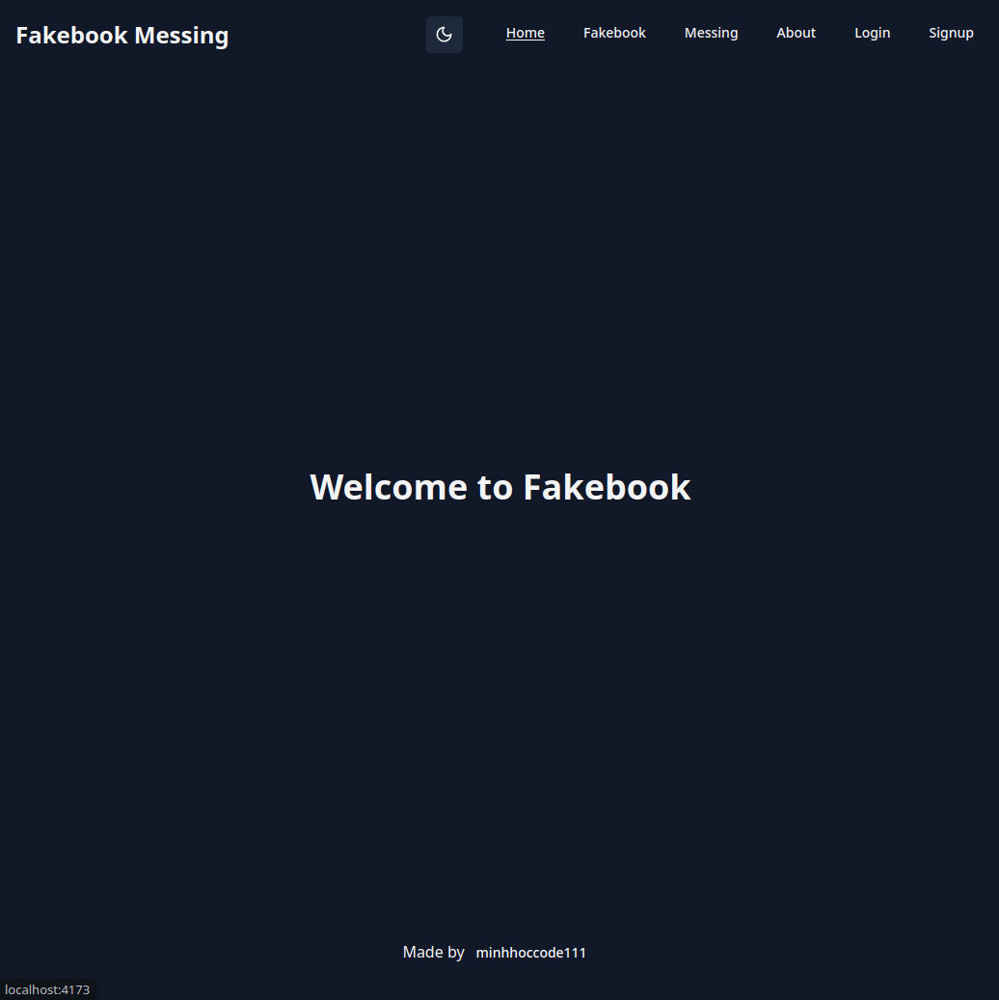
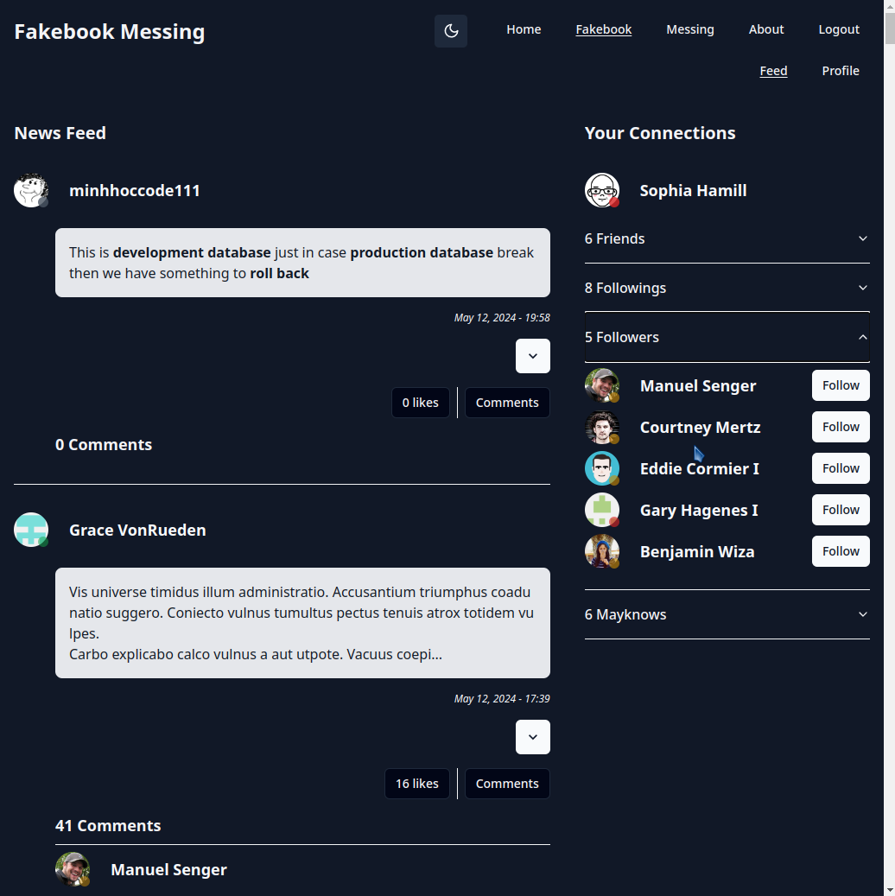
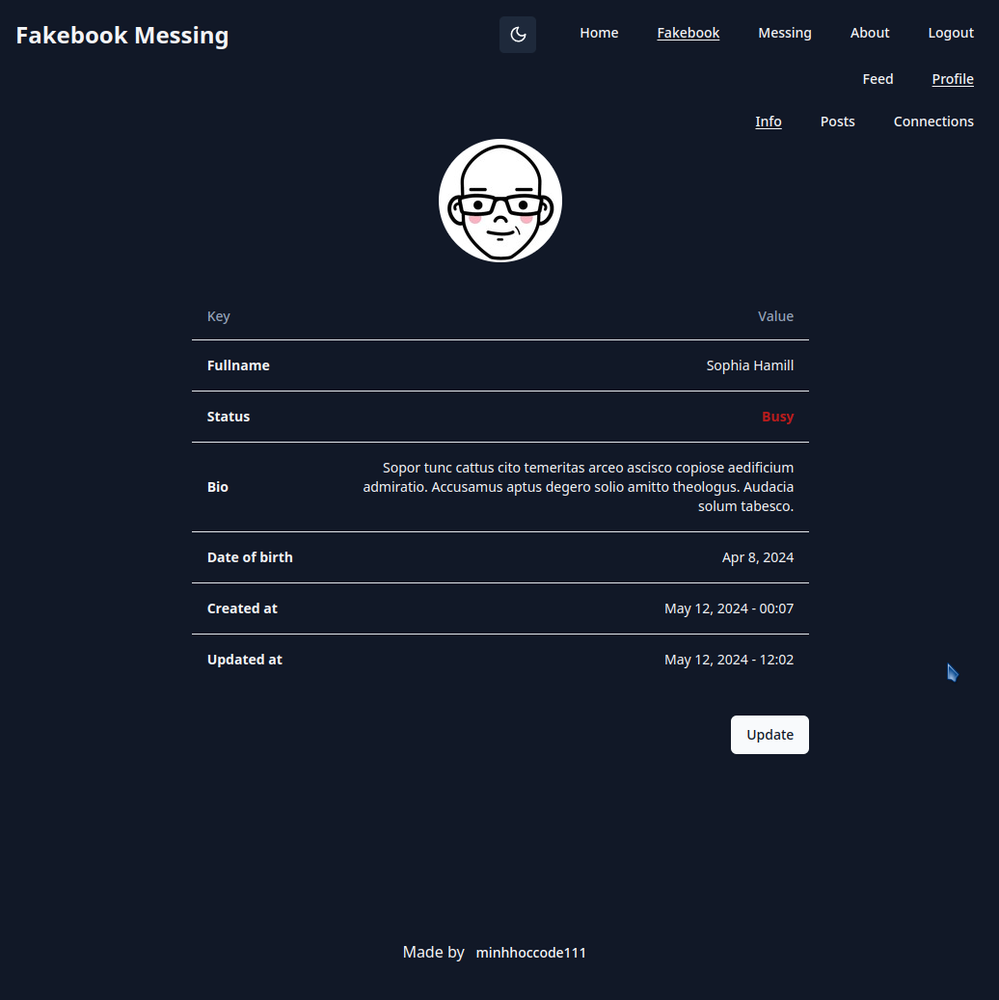
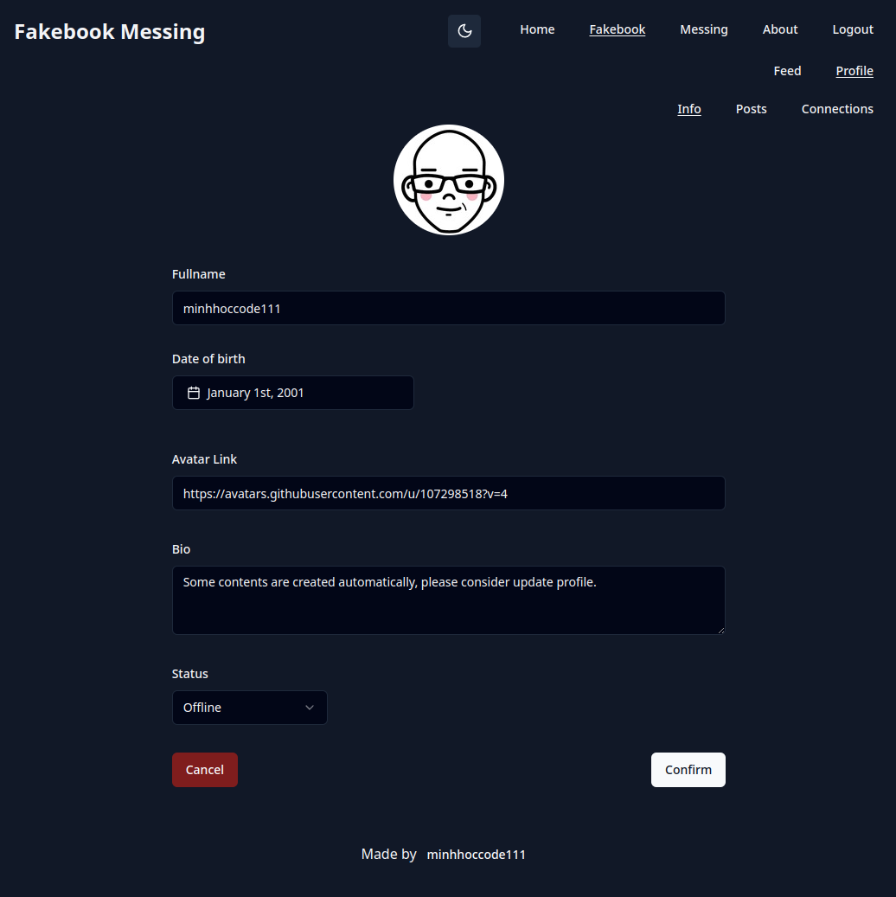
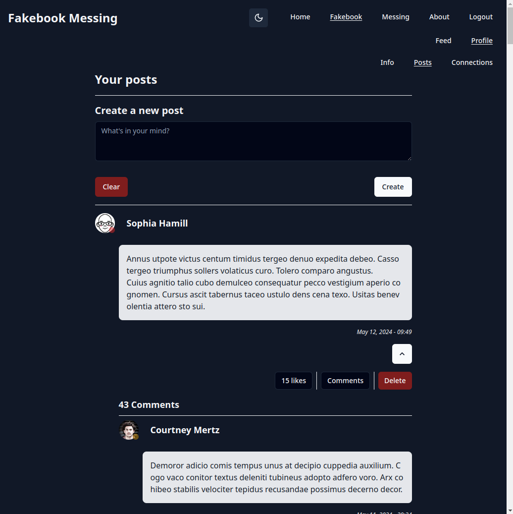
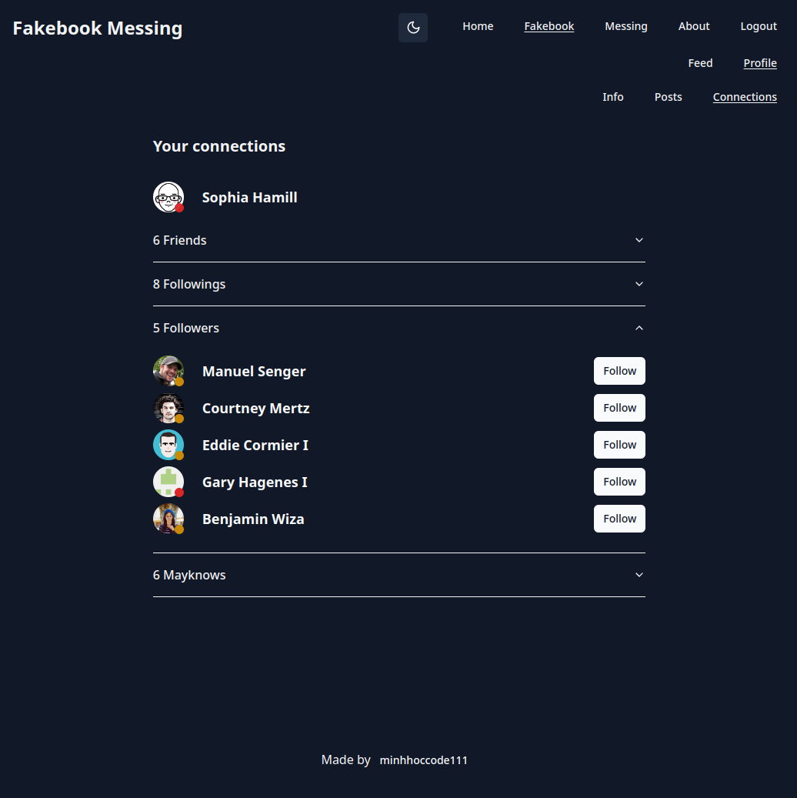
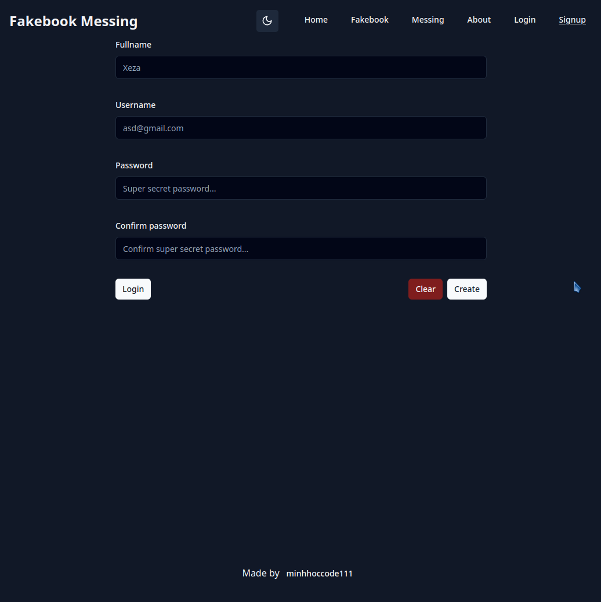
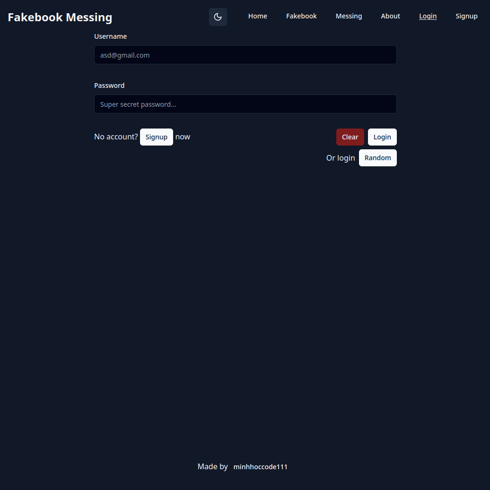

# Fakebook Messing

The **Fakebook Messing** application is created according to the assignment from **The Odin Project** [course](https://www.theodinproject.com/lessons/nodejs-odin-book).
<br>
<br>

## **Demo** [here](https://fakebook.vercel.app)

## **Features**
* Follow and Unfollow
* News feed display all posts (preview) of users we're following
* View and edit profile
* View all posts of a user
* Create a post
* Like a post 
* Comment on a post
* Like a comment
* View all connections of a user

## **Getting Started**
HTTPS 
```bash
git clone https://github.com/minhhoccode111/fakebook-messing.git
```

or SSH 
```bash
git clone git@github.com:minhhoccode111/fakebook-messing.git
```

then run server
```bash
cd fakebook-messing/back
npm install
npm run dev
```

then run client
```bash
cd fakebook-messing/front
npm install
npm run dev
```

then navigate [here](http://localhost:5173)


## **Navigation**
- See [all my projects'](https://github.com/minhhoccode111/minhhoccode111#projects) live demos
* See my previous project [Messaging App Front](https://github.com/minhhoccode111/messaging-app-front) and [Messaging App Back](https://github.com/minhhoccode111/messaging-app-back)

### **Backend** [here](back/README.md)
### **Frontend** [here](front/README.md)

<!-- * See my next project []() -->


## Preview

<details>
    <summary>Some screenshots</summary>









</details>

